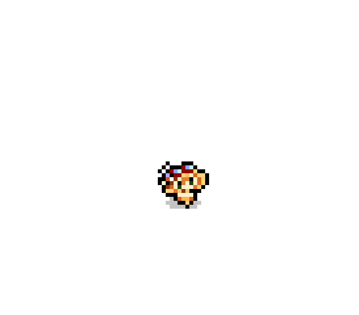

GoTerPix

Pixel art images right into your terminal!

`Build`  

    git clone https://github.com/FinecoFinit/goterpix.git
    cd goterpix
    go build goterpix.go

`Usage`  

    ./goterpix summer_Illumine.gif 60
    goterpix | path to gif image | frame delay in milliseconds

`Limitations`

    - Only gif images are usable at the moment
    - Image should be perfect 1 to 1 pixels 
    - Frame drawing depends on your terminal performance 
